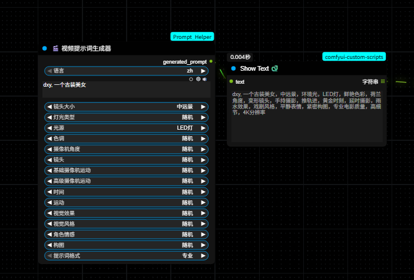

# ComfyUI Prompt Helper - AI提示词生成器套件

## 简介 / Introduction

**ComfyUI Prompt Helper** 是一个专为 ComfyUI 设计的综合性自定义节点插件套件，提供强大的AI提示词生成功能。该插件套件包含**视频提示词生成器**和**图片提示词生成器**，支持中英文双语界面，帮助用户快速构建专业的创意提示词。

**ComfyUI Prompt Helper** is a comprehensive custom node plugin suite designed for ComfyUI that provides powerful AI prompt generation capabilities. This suite includes both **Video Prompt Generator** and **Image Prompt Generator**, supporting bilingual Chinese-English interface to help users quickly build professional creative prompts.

## 功能特点 / Features

### 🎬 视频提示词生成器 / Video Prompt Generator
- **专业电影化提示词生成** - 构建高质量的视频生成提示词
- **14个专业分类** - 覆盖电影制作的各个方面
- **智能随机选择** - 每个属性支持随机功能，激发创意灵感

### 🎨 图片提示词生成器 / Image Prompt Generator  
- **专业艺术提示词生成** - 构建高质量的图片生成提示词
- **11个艺术分类** - 覆盖艺术创作的各个维度，新增艺术家风格
- **智能随机选择** - 支持随机创意组合，探索无限可能
- **艺术家风格模拟** - 支持梵高、毕加索、莫奈等大师风格

### 🌟 共同特性 / Common Features
- 🌐 **双语支持** - 自动检测系统语言，支持中文和英文界面
- 🎯 **三种格式输出** - 专业、简单、详细三种提示词格式
- 🔧 **高度可定制** - 丰富的配置选项和预设
- 🎲 **智能随机选择** - 每个属性支持随机功能，激发创意灵感
- 🎯 **随机种子控制** - 支持固定种子复现结果或自动种子保证随机性
- 📚 **内置示例** - 包含多个使用示例和最佳实践

## 分类选项 / Categories

### 🎬 视频提示词生成器 - 14个专业分类

1. **镜头大小 / Shot Size** - 全景、中景、特写等
2. **灯光类型 / Lighting Type** - 自然光、戏剧化灯光、柔光等
3. **光源 / Light Source** - 阳光、月光、火光等
4. **色调 / Color Tone** - 暖色调、冷色调、高对比度等
5. **摄像机角度 / Camera Angle** - 平视、仰视、俯视等
6. **镜头 / Lens** - 广角、人像、长焦等
7. **基础摄像机运动 / Basic Camera Movement** - 静态、平移、缩放等
8. **高级摄像机运动 / Advanced Camera Movement** - 推轨、斯坦尼康、航拍等
9. **时间 / Time of Day** - 黎明、黄昏、夜晚等
10. **运动 / Motion** - 慢动作、快动作、正常速度等
11. **视觉效果 / Visual Effects** - 镜头光晕、雨滴、雾气等
12. **视觉风格 / Visual Style** - 电影风格、纪录片、动作等
13. **角色情感 / Character Emotion** - 开心、悲伤、紧张等
14. **构图 / Composition** - 三分法、对称、非对称等

### 🎨 图片提示词生成器 - 11个艺术分类

1. **主题类型 / Subject Type** - 人物、动物、风景、物体等
2. **艺术风格 / Art Style** - 写实摄影、油画、水彩、数字艺术、赛博朋克等
3. **情绪氛围 / Mood & Atmosphere** - 宁静、戏剧性、神秘、欢乐等
4. **色彩搭配 / Color Palette** - 暖色调、冷色调、单色调、高对比度等
5. **光照效果 / Lighting** - 柔光、硬光、黄金时刻、戏剧性灯光等
6. **构图方式 / Composition** - 三分法、中心构图、黄金比例、S型构图等
7. **相机设置 / Camera Settings** - 浅景深、深景深、虚化效果等
8. **质感细节 / Texture & Detail** - 高度细致、光滑、粗糙、金属质感等
9. **环境场景 / Environment** - 室内、户外、自然、城市等
10. **质量增强 / Quality Enhancement** - 4K、8K、超高细节、杰作、社交媒体级等
11. **艺术家风格 / Artist Style** - 梵高风格、毕加索风格、莫奈风格、达利风格等

## 安装方法 / Installation

### 方法一：Git Clone（推荐）

```bash
cd ComfyUI/custom_nodes
git clone https://github.com/flybirdxx/ComfyUI_Prompt_Helper.git
```

### 方法二：手动下载

1. 下载本仓库的 ZIP 文件
2. 解压到 `ComfyUI/custom_nodes/` 目录
3. 重启 ComfyUI

## 使用方法 / Usage

1. **启动 ComfyUI** - 插件会自动加载并检测系统语言
2. **选择节点类型** - 根据需要选择不同的生成器：
   - 🎬 **视频提示词生成器** / **Video Prompt Generator** - 适用于视频生成
   - 🎨 **图片提示词生成器** / **Image Prompt Generator** - 适用于图片生成
3. **配置参数** - 从各个分类中选择所需的选项
   - 选择 "无" - 该属性不会包含在最终提示词中
   - 选择 "随机" - 从该属性的所有选项中随机选择一个
   - 选择具体选项 - 使用指定的属性值
4. **生成提示词** - 插件会自动组合生成专业的提示词

### 示例工作流 / Example Workflow

**基础使用示例：**
```
用户输入: "一个战士在战场上奔跑"
配置选项:
- 镜头大小: 中景
- 灯光类型: 戏剧化灯光
- 色调: 高对比度
- 摄像机角度: 仰视角度
- 提示词格式: 专业

输出结果: "一个战士在战场上奔跑，中景，戏剧化灯光，高对比度，仰视角度，专业电影质量，高细节，4K分辨率"
```

**视频随机功能示例：**
```
用户输入: "一个美丽的风景"
配置选项:
- 镜头大小: 随机
- 灯光类型: 随机
- 色调: 随机
- 摄像机角度: 无
- 其他属性: 随机/无

可能的输出结果: "一个美丽的风景，特写镜头，柔光，中性色调，鱼眼镜头，云台平滑运动，正午，火焰效果，愤怒表情，专业电影质量，高细节，4K分辨率"
```

**图片随机功能示例：**
```
用户输入: "一个美丽的女孩"
配置选项:
- 主题类型: 人物
- 艺术风格: 随机
- 情绪氛围: 浪漫的
- 色彩搭配: 随机
- 艺术家风格: 随机
- 其他属性: 随机/无

可能的输出结果: "一个美丽的女孩。风格：人物，印象派，浪漫的，梵高风格。技术：柔光，景深层次，浅景深。美学：粉彩色，皮革质感，户外，超高细节。精致细节，艺术级质量，完美构图"
```



## 🎲 随机功能详解 / Random Feature Guide


- 🎨 **激发创意灵感** - 发现意想不到的视觉组合
- 🎬 **快速原型制作** - 快速生成多样化的测试提示词
- 🔄 **打破创作惯性** - 突破固有的思维模式
- 🎪 **实验性创作** - 探索新的视觉风格和表现方式

### 🎯 随机种子控制
v0.3.0版本新增的随机种子功能让您完全控制随机性：

- **固定种子（0-2147483647）** - 使用相同种子可以复现完全相同的随机结果
- **自动种子（-1）** - 每次生成都使用不同种子，确保结果完全随机
- **种子显示** - 控制台会显示实际使用的种子值，方便记录和复现
- **完美复现** - 记录喜欢的种子值，随时重新生成相同的提示词

### 如何使用随机功能？

1. **选择随机选项**
   - 在任意属性下拉菜单中选择"随机"（中文）或"random"（英文）
   - 可以在多个属性中同时选择随机
   - 也可以将随机选项与固定选项混合使用

2. **设置随机种子**
   - 随机种子 = -1：每次都使用不同的随机种子（默认）
   - 随机种子 = 固定数值：使用固定种子，可以复现相同结果
   - 控制台会显示实际使用的种子值

3. **查看随机结果**
   - 每次随机选择会在控制台显示实际选中的选项
   - 格式：`[随机选择] 属性名: 选中的值`
   - 种子信息：`[生成器] 使用随机种子: 12345`

3. **混合使用策略**
   ```
   示例：电影级人像拍摄
   - 镜头大小: 特写镜头 (固定)
   - 灯光类型: 随机 (让系统选择灯光效果)
   - 色调: 暖色调 (固定)
   - 摄像机角度: 随机 (探索不同角度)
   - 其他属性: 根据需要选择随机或固定
   ```

### 随机功能技术细节

- **智能过滤**: 随机选择会自动排除"无"和"随机"选项本身
- **双语支持**: 中英文界面下随机功能完全一致
- **实时生成**: 每次执行都会产生不同的随机组合
- **控制台输出**: 详细记录每个随机选择的结果，便于复现优秀的组合

## 文件结构 / File Structure

```
ComfyUI_Prompt_Helper/
├── __init__.py                                  # 插件初始化文件
├── nodes.py                                     # 视频提示词生成器代码
├── image_nodes.py                               # 图片提示词生成器代码
├── Prompt_Presets.json                          # 视频预设配置文件
├── Image_Presets.json                           # 图片预设配置文件
├── ui_labels.json                              # 视频界面标签文件
├── image_ui_labels.json                        # 图片界面标签文件
├── assert/                                     # 资源文件夹
│   └── wechat_2025-08-05_002819_786.png       # 功能截图
└── README.md                                   # 说明文档
```

## 配置文件 / Configuration Files

### 视频提示词生成器 / Video Prompt Generator
- **Prompt_Presets.json** - 包含视频生成的所有分类预设选项
- **ui_labels.json** - 定义视频生成器界面标签的多语言文本

### 图片提示词生成器 / Image Prompt Generator
- **Image_Presets.json** - 包含图片生成的所有分类预设选项
- **image_ui_labels.json** - 定义图片生成器界面标签的多语言文本

## 自定义配置 / Customization

您可以通过编辑 JSON 配置文件来自定义选项：

1. 编辑 `Prompt_Presets.json` 添加新的预设选项
2. 修改 `ui_labels.json` 更新界面文本

## 兼容性 / Compatibility

- **ComfyUI** - 支持最新版本的 ComfyUI
- **Python** - 需要 Python 3.7+
- **操作系统** - 支持 Windows、macOS、Linux

## 许可证 / License

本项目采用 MIT 许可证 - 详见 [LICENSE](LICENSE) 文件

## 贡献 / Contributing

欢迎提交 Issue 和 Pull Request！

## 更新日志 / Changelog

### v0.2.0 (2024-12-19)
- 🎨 **全新功能：图片提示词生成器**
  - 独立的图片提示词生成器节点
  - 10个专门的艺术分类，覆盖图片生成的各个方面
  - 专为AI图片生成优化的提示词结构
  - 完整的随机功能支持
  - 双语界面完美适配
- ✨ **增强现有功能**
  - 重构项目结构，视频和图片生成器完全分离
  - 优化了配置文件组织方式
  - 改进了节点注册和管理系统
- 🔧 **技术改进**
  - 模块化代码架构，便于维护和扩展
  - 统一的随机选择算法
  - 增强的错误处理和日志输出

### v0.1.2 (2024-12-19)
- ✨ **新功能：智能随机选择**
  - 为所有14个属性分类添加"随机"选项
  - 支持从每个分类中随机选择选项，激发创意灵感
  - 每次随机选择都会在控制台显示选中的选项
  - 完美支持中英文双语随机功能
- 🔧 **技术改进**
  - 优化了选项映射逻辑
  - 改进了随机算法确保选择的多样性
  - 增强了代码的可维护性

### v1.0.0
- 初始版本发布
- 支持14个专业分类
- 双语界面支持
- 三种提示词格式

## 致谢 / Acknowledgments

- 感谢 [ComfyUI](https://github.com/comfyanonymous/ComfyUI) 提供的优秀平台

---

